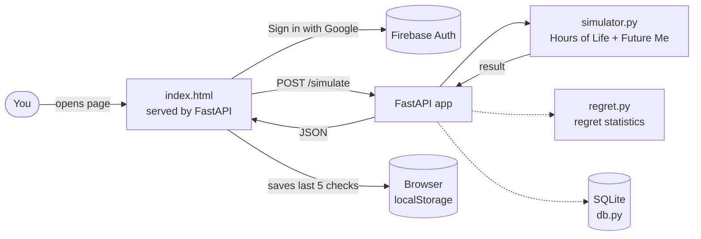

<div align="center">



### Every price tag is a bill for your time.

[](https://hindsight-4w7d.onrender.com)


</div>

---

> **The idea.** You think in rupees. You *earn* in hours. Hindsight translates one into the other **before** you pay, and shows what the purchase does to your month and your savings goal. This README is a receipt for the same reason: to show the cost up front.

```
==============================================
              H I N D S I G H T
        PURCHASE CHECK  ·  ORDER #001
==============================================
Sneakers .............................. ₹8,000
Your hourly rate ..................... ₹250/hr
----------------------------------------------
HOURS OF LIFE ......................... 32 hrs
   = 4 full working days
SAVINGS GOAL PUSHED BACK .............. 1.4 mo
MONTH END AFTER ...................... −₹2,000
==============================================
                STILL WANT IT?
==============================================
```

<div align="center">

<br>
<sub>The demo runs on a free plan, so the first load after a quiet spell can take a minute while it wakes up.</sub>
</div>

---

## 🧾 Order in 30 seconds

1. Open the **[live demo](https://hindsight-4w7d.onrender.com)**.
2. Tap **Try an example**, then **Check purchase**.
3. Watch the gauge fill: **₹8,000** on a **₹40,000** income is **32 hours** of work, and the savings goal slips **1.4 months**.


Sign in with Google for a personal greeting and a **Recent checks** history per account.

---

## 🍽️ What's on the menu

```
==============================================
                 TODAY'S MENU
==============================================
 QTY  ITEM                          STATUS
----------------------------------------------
  1   Hours of Life                 [LIVE]
      price → hours of your month
  1   Future Me simulator           [LIVE]
      month-end balance + goal delay
  1   Google sign-in                [LIVE]
      Firebase Auth, per-user history
  1   Recent checks                 [LIVE]
      your last five, kept in-browser
  1   Regret Score                  [COOKING]
      rate it days later; app learns
      logic + tests done, UI next
  1   Smart import                  [PLANNED]
      bank CSV → auto-categorized
----------------------------------------------
   ALL PRICES IN HOURS. NO REFUNDS ON TIME.
```

---

## 🧮 How the total is calculated

All money math is plain, deterministic Python. **No AI does arithmetic**, so every number is predictable and testable.

| Formula | |
|---|---|
| **Hours of Life** | `price ÷ (monthly income ÷ 160 working hours)` |
| **Free cash** | `projected month-end balance − monthly goal contribution` |
| **Shortfall** | `max(0, price − free cash)` |
| **Goal delay** | `shortfall ÷ monthly goal contribution` (in months) |

A purchase is paid from free cash first. **Only the shortfall delays your goal.**

<details>
<summary><b>🧾 See the itemized receipt for the ₹8,000 example</b></summary>

<br>

```
==============================================
              THE MATH, ITEMIZED
==============================================
Price ................................. ₹8,000
Monthly income ....................... ₹40,000
Projected month-end balance ........... ₹6,000
Monthly goal contribution ............. ₹5,000
----------------------------------------------
Hourly rate  (40,000 ÷ 160) ............. ₹250
HOURS OF LIFE  (8,000 ÷ 250) .......... 32 hrs
Free cash  (6,000 − 5,000) ............ ₹1,000
Shortfall  (8,000 − 1,000) ............ ₹7,000
GOAL DELAY  (7,000 ÷ 5,000) ........... 1.4 mo
MONTH END AFTER  (6,000 − 8,000) ..... −₹2,000
==============================================
```

</details>

**Regret statistics** use simple group rates (per category and time of day) with a minimum sample size, so the app stays quiet instead of over-claiming when data is thin.

---

## 🏗️ Behind the counter



<sub>Solid lines are live today; dotted lines are built but not yet wired to the UI.</sub>

---

## 🔌 Talk to the cashier (API)

Interactive docs live at **`/docs`** on the running app.

| Method | Path | Purpose |
|---|---|---|
| `GET` | `/health` | Health check |
| `GET` | `/hours-of-life` | Convert a price to hours of work |
| `POST` | `/simulate` | Run the Future Me simulation |

```bash
curl -X POST https://hindsight-4w7d.onrender.com/simulate \
  -H "Content-Type: application/json" \
  -d '{"price":8000,"projected_month_end_balance":6000,"goal_monthly_contribution":5000,"monthly_income":40000}'
```

<details>
<summary><b>Example request and response</b></summary>

<br>

```json
{
  "price": 8000,
  "projected_month_end_balance": 6000,
  "goal_monthly_contribution": 5000,
  "monthly_income": 40000
}
```

Response:

```json
{
  "month_end_before": 6000,
  "month_end_after": -2000,
  "goal_delay_months": 1.4,
  "budget_remaining_after": null,
  "hours_of_life": 32
}
```

</details>

---

## 💻 Run your own store

```bash
git clone https://github.com/paarthmishra-git/hindsight.git
cd hindsight/backend

python -m venv venv
venv\Scripts\activate        # Windows
# source venv/bin/activate   # Mac / Linux

pip install -r requirements.txt pytest
pytest                        # run the tests
uvicorn app.main:app --reload
```

Then open <http://127.0.0.1:8000>.

<details>
<summary><b>Google sign-in on localhost</b></summary>

<br>

The Firebase web key in `backend/static/index.html` is restricted by HTTP referrer. To sign in locally, open the app at `http://127.0.0.1:8000` or `http://localhost:8000`, both of which are on the allow-list. If you fork the project, create your own Firebase project and replace the `firebaseConfig` block.

</details>

---

## 📁 Floor plan

```
hindsight/
├── README.md
├── docs/
│   ├── receipt-banner.svg  # animated header
│   ├── screenshot.png
│   └── demo.gif
└── backend/
    ├── requirements.txt
    ├── app/
    │   ├── main.py         # FastAPI routes + serves the frontend
    │   ├── simulator.py    # Hours of Life and Future Me math
    │   ├── regret.py       # Regret statistics and warnings
    │   └── db.py           # SQLite schema
    ├── static/
    │   └── index.html      # The frontend (one file, no build step)
    └── tests/
        └── test_core.py
```

---

## 📜 Store policy (design decisions)

- **Deterministic core.** Financial math lives in code, not in a language model, so it is exact and testable. An LLM is planned only for categorizing messy bank data and phrasing explanations.
- **One service.** FastAPI serves both the API and the page, so the app deploys as a single unit.
- **Honest insights.** Regret warnings need a minimum number of ratings before they appear.
- **Safe public keys.** The Firebase web key is public by design, so it is locked to this app's domains and to the sign-in APIs only. Anything billable stays on the server.

---

## 🛒 Next orders (roadmap)

```
Core      ██████████  Hours of Life + Future Me simulator
Regret    ███████░░░  Statistics and tests done, check-in UI next
Accounts  ████░░░░░░  Sign-in live, persistent storage next
Import    ░░░░░░░░░░  CSV import with categorization
```

- [x] Hours of Life and Future Me simulator
- [x] Regret statistics with tests
- [x] Responsive frontend
- [x] Google sign-in (Firebase Auth)
- [x] Deployed with auto-deploy on push
- [ ] Regret check-in flow (rate a purchase a few days later)
- [ ] Verify sign-in tokens on the backend
- [ ] Save history to the account instead of the browser
- [ ] CSV import with automatic categorization
- [ ] Demo mode with sample data

---

<div align="center">

```
==============================================
         THANK YOU FOR CHECKING FIRST
 Was it worth it? Hindsight says: ask before.
==============================================
██ ██ ██  ███ █ █ █ ██ █ █ ██  ███  █ █ ███  █
█  ██ █  ██  ███  █  ███ █ █ █ █ ███  ██ ██ ██
            8000 · 160 · 32 · 1.4
```

Built by [Paarth Mishra](https://github.com/paarthmishra-git) · **[Open the live demo →](https://hindsight-4w7d.onrender.com)**

</div>
