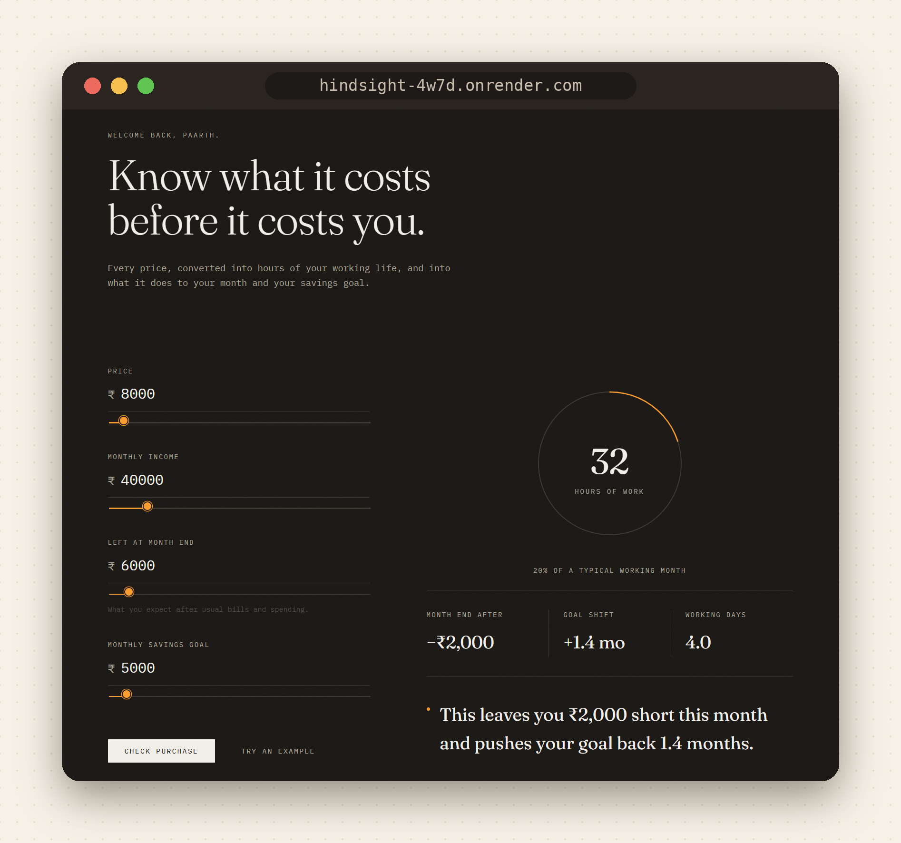

<div align="center">

# ● hindsight

### Know what it costs before it costs you.

Every price, converted into **hours of your working life**, and into what it does to your month and your savings goal.

[](https://hindsight-4w7d.onrender.com)


<br>



<sub>The demo runs on a free plan, so the first load after a quiet spell can take a minute while it wakes up.</sub>

</div>

---

## Contents

[Try it in 30 seconds](#-try-it-in-30-seconds) · [Features](#-features) · [How the numbers work](#-how-the-numbers-work) · [Architecture](#-architecture) · [API](#-api) · [Run locally](#-run-it-locally) · [Structure](#-project-structure) · [Design decisions](#-design-decisions) · [Roadmap](#-roadmap)

---

## ⚡ Try it in 30 seconds

1. Open the **[live demo](https://hindsight-4w7d.onrender.com)**.
2. Click **Try an example**, then **Check purchase**.
3. Watch the gauge fill. A ₹8,000 purchase on a ₹40,000 income is **32 hours** of work, and it pushes the savings goal back **1.4 months**.

<div align="center">

</div>

Sign in with Google to see a personal greeting and keep your **Recent checks** history per account.

---

## ✨ Features

| | Feature | What you get | Status |
|---|---|---|---|
| ⏳ | **Hours of Life** | Any price converted into hours of your working month | ✅ Live |
| 🔮 | **Future Me simulator** | Month-end balance after the purchase, and how far it pushes back your savings goal | ✅ Live |
| 🔐 | **Google sign-in** | Firebase Authentication, personal greeting and per-user history | ✅ Live |
| 🗂️ | **Recent checks** | Your last five checks, saved in the browser so you can compare over time | ✅ Live |
| 😬 | **Regret Score** | Rate purchases a few days later; the app learns which categories and times of day you regret | 🛠️ Logic and tests done, UI in progress |
| 📥 | **Smart import** | Upload a bank CSV and auto-categorize transactions | 📅 Planned |

---

## 🧮 How the numbers work

All money math is plain, deterministic Python. No AI does arithmetic, so results are predictable and testable.

**Hours of Life**

```
hours = price ÷ (monthly income ÷ 160 working hours)
```

**Future Me simulator**

```
free cash   = projected month-end balance − monthly savings goal contribution
shortfall   = max(0, price − free cash)
goal delay  = shortfall ÷ monthly goal contribution   (in months)
```

A purchase is paid from free cash first. Only the **shortfall** delays your goal.

<details>
<summary><b>Worked example (click to expand)</b></summary>

<br>

| Input | Value |
|---|---|
| Price | ₹8,000 |
| Monthly income | ₹40,000 |
| Projected month-end balance | ₹6,000 |
| Monthly goal contribution | ₹5,000 |

1. Hourly rate = 40,000 ÷ 160 = **₹250/hour**
2. Hours of Life = 8,000 ÷ 250 = **32 hours** (4 working days)
3. Free cash = 6,000 − 5,000 = **₹1,000**
4. Shortfall = 8,000 − 1,000 = **₹7,000**
5. Goal delay = 7,000 ÷ 5,000 = **1.4 months**
6. Month end after = 6,000 − 8,000 = **−₹2,000**

</details>

**Regret statistics** use simple group rates (per category and time of day) with a minimum sample size, so the app stays quiet instead of over-claiming when data is thin.

---

## 🏗️ Architecture


<sub>Solid lines are live today; dotted lines are built but not yet wired to the UI.</sub>

---

## 🔌 API

Interactive docs are at **`/docs`** on the live app.

| Method | Path | Purpose |
|---|---|---|
| `GET` | `/health` | Health check |
| `GET` | `/hours-of-life` | Convert a price to hours of work |
| `POST` | `/simulate` | Run the Future Me simulation |

<details>
<summary><b>Example request and response</b></summary>

<br>

```http
POST /simulate
```

```json
{
  "price": 8000,
  "projected_month_end_balance": 6000,
  "goal_monthly_contribution": 5000,
  "monthly_income": 40000
}
```

Response:

```json
{
  "month_end_before": 6000,
  "month_end_after": -2000,
  "goal_delay_months": 1.4,
  "budget_remaining_after": null,
  "hours_of_life": 32
}
```

</details>

Try it from a terminal:

```bash
curl -X POST https://hindsight-4w7d.onrender.com/simulate \
  -H "Content-Type: application/json" \
  -d '{"price":8000,"projected_month_end_balance":6000,"goal_monthly_contribution":5000,"monthly_income":40000}'
```

---

## 💻 Run it locally

```bash
git clone https://github.com/paarthmishra-git/hindsight.git
cd hindsight/backend

python -m venv venv
venv\Scripts\activate        # Windows
# source venv/bin/activate   # Mac / Linux

pip install -r requirements.txt pytest
pytest                        # run the tests
uvicorn app.main:app --reload
```

Then open <http://127.0.0.1:8000>.

<details>
<summary><b>Google sign-in on localhost</b></summary>

<br>

The Firebase web key in `backend/static/index.html` is restricted by HTTP referrer. To sign in locally, open the app at `http://127.0.0.1:8000` or `http://localhost:8000`, both of which are on the allow-list. If you fork the project, create your own Firebase project and replace the `firebaseConfig` block.

</details>

---

## 📁 Project structure

```
hindsight/
├── README.md
├── docs/
│   ├── screenshot.png      # used by this README
│   └── demo.gif
└── backend/
    ├── requirements.txt
    ├── app/
    │   ├── main.py         # FastAPI routes + serves the frontend
    │   ├── simulator.py    # Hours of Life and Future Me math
    │   ├── regret.py       # Regret statistics and warnings
    │   └── db.py           # SQLite schema
    ├── static/
    │   └── index.html      # The frontend (one file, no build step)
    └── tests/
        └── test_core.py
```

---

## 🧭 Design decisions

- **Deterministic core.** The financial math lives in code, not in a language model, so it is exact and testable. An LLM is planned only for categorizing messy bank data and phrasing explanations.
- **One service.** FastAPI serves both the API and the page, so the whole app deploys as a single unit.
- **Honest insights.** Regret warnings need a minimum number of ratings before they appear.
- **Safe public keys.** The Firebase web key is public by design, so it is locked to this app's domains and to the sign-in APIs only. Anything billable stays on the server.

---

## 🗺️ Roadmap

```
Core        ██████████  Hours of Life + Future Me simulator
Regret      ███████░░░  Statistics and tests done, check-in UI next
Accounts    ████░░░░░░  Sign-in live, persistent storage next
Import      ░░░░░░░░░░  CSV import with categorization
```

- [x] Hours of Life and Future Me simulator
- [x] Regret statistics with tests
- [x] Responsive frontend
- [x] Google sign-in (Firebase Auth)
- [x] Deployed with auto-deploy on push
- [ ] Regret check-in flow (rate a purchase a few days later)
- [ ] Verify sign-in tokens on the backend
- [ ] Save history to the account instead of the browser
- [ ] CSV import with automatic categorization
- [ ] Demo mode with sample data

---

<div align="center">

Built by [Paarth Mishra](https://github.com/paarthmishra-git) · **[Open the live demo →](https://hindsight-4w7d.onrender.com)**

</div>
